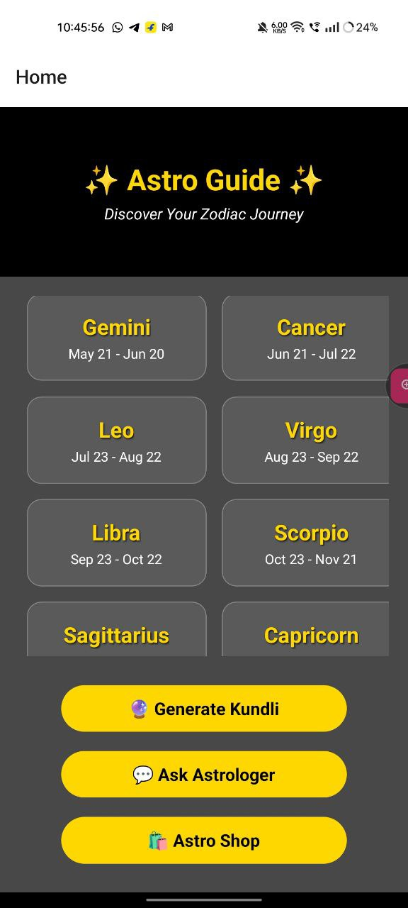
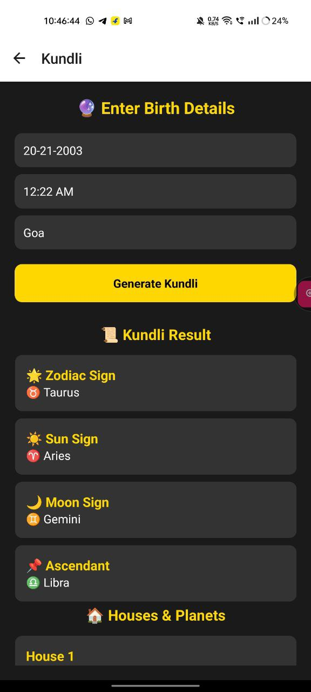
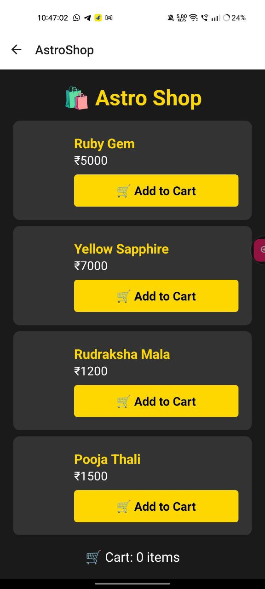
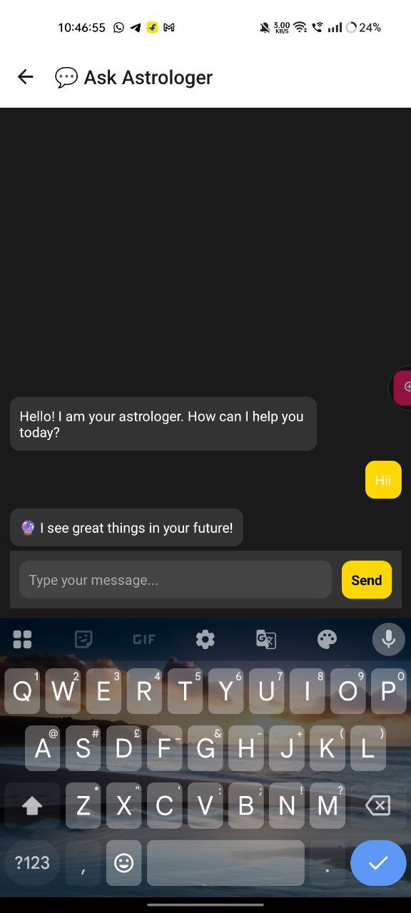

# 🌟 AstroApp

AstroApp is a React Native application that provides astrology-related services such as horoscope readings, Kundli generation, fake chat consultations, and an astrology shop.

---

## 📸 App Screenshots

| Home Screen | Kundli Screen |
|------------|-------------|
|  |  |

| Astro Shop | Fake Chat |
|------------|-------------|
|  |  |

---

## 📌 Features

- 🔮 **Daily Horoscope** – View your zodiac sign's horoscope.
- 📝 **Kundli Generation** – Enter birth details to generate a basic Kundli.
- 📞 **Fake Chat Consultation** – Simulated astrology chat feature.
- 🛒 **Astro Shop** – Browse and explore astrological items like gemstones, yantras, and pooja essentials.

---

---

## 🚀 Installation & Setup

### 1️⃣ Clone the repository:
```bash
git clone https://github.com/yourusername/astroapp.git
cd astroapp

